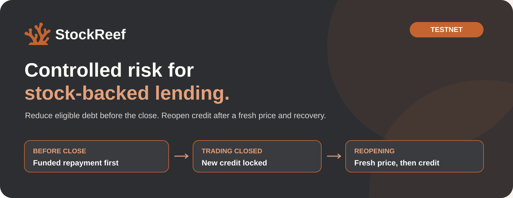
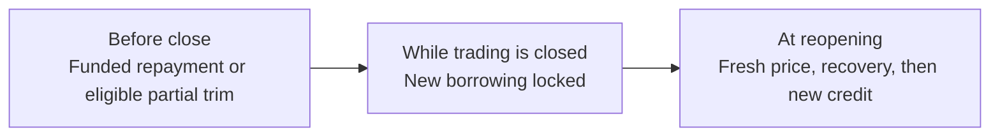

<div align="center">


# StockReef

### Controlled risk for stock-backed lending.

StockReef helps reduce TSLA-backed debt before market closures and controls when new USDG credit can resume.

**[Open StockReef](https://stock-reef.vercel.app/)** · **[Demo video script](docs/DEMO_VIDEO_SCRIPT.md)** · **[How risk is controlled](#how-stockreef-controls-risk)** · **[Friday example](#a-friday-close-in-numbers)** · **[Run locally](#run-locally)**

`Robinhood Chain 46630` · `Paxos USDG` · `Faucet TSLA` · `Operator-set price and clock`



</div>

[Vertical 9:16 presentation template](docs/assets/stockreef-vertical-template.svg)

The current implementation includes a TSLA/USDG lending market, a keeper, and a web app. The keeper submits permissionless transactions; the contracts enforce the rules on every call.

The app runs one scripted weekend: a Friday close and the Monday reopening, with TSLA moving from 400.00 to a 376.00 reopening price. Only the clock and the TSLA price are scripted. Balances, collateral value, LTV, thresholds, borrow limits, trim and buffer amounts, and lender valuation come from the deployed contracts at each scripted step. MetaMask signing, confirmations and explorer receipts are real. See [what is scripted and what is live](#the-scripted-session).



The borrower funds a repayment buffer in advance. A liquidator supplies their own USDG for a trim. Either action reduces debt only after someone submits a successful transaction.

Built for the [Arbitrum Open House Singapore buildathon](https://www.hackquest.io/hackathons/Arbitrum-Open-House-Singapore-Online-Buildathon). [Contracts](contracts/src) · [Evidence](evidence) · [Security](docs/SECURITY.md)

## The debt already exists

A borrowing lock can stop a loan from getting larger over the weekend. It cannot make an existing loan smaller.

That is the problem StockReef addresses. A stock-backed loan can enter Friday's close within its normal limit and reopen on Monday with much less collateral coverage. Waiting until the reopening means acting after the price has already moved.

StockReef brings that decision forward. Borrowers see the repayment or collateral top-up needed before the close. Funded plans repay first. Loans above the falling threshold become eligible for partial liquidation while a usable regular-session price is still available.

## How StockReef controls risk

### Carry less debt into the gap

**Existing loans are managed before trading closes.** Two hours before each scheduled close, the liquidation threshold starts falling. The ramp finishes 30 minutes before the bell, leaving time to execute at the final threshold.

An ordinary overnight closure gets a shallower adjustment than a weekend or holiday. The borrow limit falls alongside the liquidation threshold, so borrowers cannot keep adding debt against the old limit.

| Current policy | Ordinary overnight | Weekend / holiday¹ |
|---|---:|---:|
| Open-session liquidation threshold | 80% | 80% |
| Threshold at close − 30 minutes | 77% | 70% |
| Target after a full solvent trim | 72% | 65% |
| Open-session borrow limit | 75% | 75% |

¹ A closure is extended when the next scheduled open is at least 24 hours away. These are deployment fixtures, not calibrated safety guarantees.

During preparation, the borrow limit is `min(75%, liquidation threshold − 5 percentage points)`. New borrowing stops entirely in the final 30 minutes.

### Keep the stock exposure you want to hold

**A funded repayment buffer can reduce debt without selling collateral or paying a liquidation bonus.** The borrower deposits USDG into a separate escrow and authorizes a target LTV, spending cap per session, and expiry. During preparation, anyone can execute that plan within its limits.

An executable buffer must run before a liquidator can trim the position. If the buffer is too small, the remaining loan can still be trimmed once eligible.

Buffer targets are currently limited to 65% LTV or lower, including on ordinary nights. Authorized funds are committed outside the normal open phase while debt and authorization remain active; the borrower can still use them to repay manually. Escrow is borrower money, separate from lender liquidity, and earns no yield.

### Reduce the position instead of closing it all

**Partial liquidation restores headroom while preserving the remainder of a solvent position.** A loan becomes eligible only when its LTV is strictly above the current threshold. A liquidator supplies USDG, repays part of the debt, and receives stock collateral at the current accepted price plus the applicable bonus.

Scheduling-only trims pay a **2% bonus**. Positions already above the normal 80% threshold pay **5%**, as do open-session and reopening recovery liquidations. A full solvent fill reaches the published target; smaller capital-limited fills are allowed. An insolvent position can exhaust its collateral.

The target is not a blanket liquidation trigger: a loan above the target but at or below the threshold is not eligible for a trim.

### Stop new risk while the market is closed

**Closed-session locks prevent new borrowing and debt-backed collateral withdrawals.** Liquidations and automated buffer execution also pause during the closure. Manual repayment and collateral deposits remain available, subject to the tokens' transfer restrictions.

The immutable regular-session calendar includes holidays, early closes, and daylight-saving changes. Outside its loaded coverage, price-dependent actions stop. Once coverage ends, lenders can withdraw available cash under the wind-down rules.

### Recover before lending again

**New credit waits for a fresh regular-session price and a recovery window.** Reopening admission cannot occur before open + 5 minutes, and the stock quote must be timestamped at or after open + 1 minute.

Once the price is admitted, eligible recovery trims can execute with a fixed **5% bonus**. Borrowing stays closed until the later of open + 15 minutes or admission + 10 minutes. A late price therefore gets the full recovery interval. This reserves time for recovery; it does not require every loan to be trimmed before credit returns. An impaired lender book independently blocks new borrowing.

Without admission by open + 30 minutes, the market enters `GUARDED`. Elapsed time never makes an invalid quote acceptable. This is a fresh-price admission and recovery window, not a multi-quote convergence test or an escalating-bonus auction.

### See what needs action, and what actually executed

**The borrower view turns a risk ratio into an amount, a deadline, and a transaction history.** It shows how much USDG to repay or TSLA to add, the applicable threshold, buffer coverage, potential trim amounts, and recent execution receipts.

Operations shows executable buffers, eligible trims, price-gate reasons, and loans still above the closing threshold. During closure and reopening wait, their displayed exposure is the repayment needed to reach the target at the available indicative valuation. It is not a prediction of the reopening loss.

The price gate checks feed freshness, timestamps, answer bounds, decimals, and configured issuer/corporate-action signals. Invalid prices stop price-dependent actions. A guardian can stop those actions immediately; resuming requires a 24-hour delay and the gate's recovery conditions.

## A Friday close in numbers

Start with **10,000 USDG of TSLA collateral and 7,200 USDG of debt: 72% LTV.** At 15:15 before a 16:00 extended close, the threshold has fallen to approximately 71.667%, making the loan eligible for a trim.

| Route | Debt reduction | Collateral used | Result |
|---|---:|---:|---|
| Funded buffer | 700.00 USDG from the borrower | None | 6,500.00 debt; 65% LTV |
| Partial trim at a 2% bonus | 2,077.15 USDG from a liquidator | 2,118.69 USDG of TSLA | About 5,122.85 debt against 7,881.31 collateral; 65% LTV |
| Nobody executes | None before the close | None before the close | Loan enters the closure unchanged apart from interest; remaining exposure is reported |

The trim needs more repayment than the buffer because it removes collateral as well as debt. These are rounded [golden values](tools/golden/golden.json) at a fixed price, before additional interest.

The [demo script](contracts/script/DemoRun.s.sol) runs all three routes at 1/100 scale, then reopens at a simulated 6% lower price. Its [committed local result](evidence/demo-31337.json) records a buffer repayment, a pre-close trim, missed execution for the untouched loan, and a reopening recovery trim. No bad debt is written off in that particular run.

## What happens to residual losses?

**Lender shares reflect the value recoverable from outstanding loans.** A collateral shortfall reduces share value as soon as the accepted valuation reflects it.

Lender shares use recoverable-value accounting:

`lender assets = cash + Σ min(accrued debt, collateral value ÷ 1.05)`

This recognizes a known shortfall in share value before collateral is exhausted, allowing for the 5% recovery bonus. When a trim exhausts collateral, the remaining debt is written off and added to `totalBadDebt`. Escrow is excluded from lender assets. When the price is unusable, the last accepted valuation is explicitly indicative.

The [concept review](docs/GAPGUARD_REVIEW.md) records earlier design alternatives and why the current accounting and execution rules were selected.

## Lend with a defined session policy

**USDG lenders fund loans whose closure rules are enforced on-chain.** Deposits receive ERC-4626 shares; repayments and liquidation proceeds return USDG to the market's cash balance.

Lender deposits and withdrawals normally open only after reopening recovery and close when preparation begins. Withdrawals are limited by available cash. New borrowing is blocked when the book is impaired, and utilization is capped at 90%.

Borrower debt currently accrues at a fixed continuously compounded 10% annual rate. This is not a promised lender APY: utilization, losses, and idle cash affect lender returns.

## Execution, not just monitoring

The [keeper](ops/keeper/src/index.ts) follows the same order on each pass:

1. Refresh the price gate and record admission or recovery checkpoints.
2. Execute funded buffers in separate transactions.
3. Re-read positions, simulate eligible trims, and submit them with liquidator capital.
4. Check receipts and report remaining exposure.

It does not choose prices or risk parameters. Anyone can refresh the gate or execute authorized buffers; anyone with USDG can trim eligible loans. **If no transaction is submitted, debt does not shrink.** Borrowing locks still apply, but neither the keeper nor the bonus guarantees an available liquidator or a profitable exit for seized stock tokens.

## Evidence you can inspect

- [Unit, fuzz, property, invariant, and fork suites](contracts/test): 535 test and invariant entry points, including four Robinhood Chain mainnet fork tests. The default Foundry profile excludes the fork suite.
- [Golden arithmetic](tools/golden): independent repayment, trim, threshold, and valuation calculations.
- [Scenario harness](tools/scenarios/run.py): compares fixed-limit lending, borrowing locks, buffers, and trims under identical price paths. It is an economic model using a linear approximation for closure interest, not a replay of on-chain execution.
- [Scenario results](evidence/scenarios.json): a modeled 35% weekend gap produces 1,014.91 USDG of lender loss without pre-close action, 247.78 after a trim, and 314.38 after a buffer. The same scenario records a 741.54 USDG inventory loss for the liquidator holding trimmed collateral through the gap. Lower lender exposure does not remove risk for everyone.
- [Mainnet fork](contracts/test/fork/RobinhoodFork.t.sol): checks real token interfaces and live feed admission at block `78471588`. The end-to-end token test mocks future feed timestamps after advancing the frozen fork.
- [Gas evidence](evidence/gas.json): bounded valuation at the current 32-borrower cap, including a lender deposit of about 388k gas.

See the [specification](docs/SPEC.md) for decisions and the [security notes](docs/SECURITY.md) for trust boundaries and known limits. Calibration against historical gaps, unbounded borrower scaling, and production deployment remain outside this prototype.

## Run locally

Requires Foundry, Python 3.12, and Node 22.

```bash
git clone --recurse-submodules https://github.com/4waan/StockReef.git
cd StockReef

python -m pip install -r tools/requirements.txt
python tools/calendar/gen_sessions.py --check
python tools/golden/golden.py --check
python tools/scenarios/run.py --check

cd contracts
forge build
forge test
```

In a separate terminal, start `anvil`. Then deploy and run the scripted demonstration from `contracts/` using Anvil's first unlocked test account:

```bash
forge script script/Deploy.s.sol --rpc-url http://127.0.0.1:8545 --broadcast \
  --unlocked --sender 0xf39Fd6e51aad88F6F4ce6aB8827279cffFb92266
forge script script/DemoRun.s.sol --rpc-url http://127.0.0.1:8545 --broadcast
```

Start the app from the repository root. Sync after deployment so it reads the generated addresses:

```bash
cd app
npm ci
npm run sync
NEXT_PUBLIC_CHAIN_ID=31337 NEXT_PUBLIC_RPC_URL=http://127.0.0.1:8545 npm run dev
```

Run the keeper in another terminal from the repository root:

```bash
cd ops/keeper
npm ci
RPC_URL=http://127.0.0.1:8545 npm run keeper -- once
```

The command above simulates only. For execution, configure `KEEPER_KEY` and a USDG-funded `LIQUIDATOR_KEY` from the [environment template](ops/keeper/.env.example), then run `npm run keeper -- watch --execute`. Load those environment variables in the shell that runs the keeper; its entry point does not automatically load `.env` files. Use test accounts locally; never commit keys.

The app opens on a landing page and has six views, all built around the borrower's current position:

| View | What it does |
|---|---|
| **Trade** (`/trade`) | Trading terminal. The market bar sits above the risk tiles (closure plan, falling threshold, funded buffer, partial liquidation). The main area charts LTV against the contract's threshold schedule, with confirmed transactions marked. The action ticket on the right covers repay, collateral, borrow and buffer, each with a review before signing. Detail panels below include permissionless buffer execution and liquidator trims. |
| **Portfolio** (`/portfolio`) | Position health dashboard: collateral, debt, LTV against the threshold, and one card per control. The controls are debt reduction, falling threshold, funded buffer, partial liquidation, closed-session protection, controlled reopening and lender loss accounting. |
| **TSLA** (`/markets/tsla`) | Asset page: company, ticker, token contract and price index, the session chart, market parameters, and the limit schedule by phase. |
| **Lend** (`/earn`) | Lender book: cash, recoverable loans and recognized shortfall, share value, a what-if price, per-loan recoverable value, and slippage-checked deposits and withdrawals. |
| **Operations** (`/operations`) | The testnet as it is now: actions ready, loans needing recovery, stock price status, the guardian stop, and operator controls. |
| **Evidence** (`/evidence`) | The worked example, the scripted closure sequence, the scenario harness, and the chain 46630 deployment. |

### The scripted session

The session bar at the bottom of Trade, Portfolio, TSLA and Lend moves through seven steps: Fri 13:00 open, 15:15 preparation, 15:30 final window, 16:00 close, Mon 09:31 reopening wait, 09:35 price admitted, and 09:45 credit returns. Use **Next step** or the arrow keys; **H** hides the bar for recording, and `?step=prep` links to a step.

| Scripted ([`app/src/lib/script.ts`](app/src/lib/script.ts)) | Live (deployed contracts, read in [`app/src/lib/scenario.ts`](app/src/lib/scenario.ts)) |
|---|---|
| One TSLA/USDG market | Account and market balances, buffer escrow and plan |
| TSLA path 400.00 → 398.40 → 397.80 → 397.20, reopening at 376.00 | Collateral value (`PriceGate.valueOf`) and LTV |
| Buttons and keys that advance the session phase | Thresholds, borrow limits, targets (`SessionRiskPolicy.ltAt`, `borrowLimit`, constants) |
| Funded public demo accounts | Trim and buffer amounts (`quoteTrim`, `executableAmount`) at the scripted snapshot |
| The 376.00 reopening price | Admission and recovery timing (gate rules; `PriceGate.refresh` once the testnet is aligned) |
| Fixed chart observations matching those prices | Wallet connection, signing, confirmations and explorer receipts, marked on the chart |

The weekend is the first Friday on the deployed calendar whose closure lasts at least 24 hours. With the testnet aligned to a step, `npm run check-scenario -- <step>` compares every field with `StockReefLens` and exits non-zero on any difference.

### Wallet safety

- **Exact approvals only.** Each token approval is for the exact amount of the action, never an unlimited allowance.
- **Simulated before signing.** Every transaction is simulated against the chain before the wallet opens. A call that would revert shows the contract's reason (for example `BufferPending`) and never reaches MetaMask.
- **Verify the contracts.** Run [`ops/verify-46630.sh`](ops/verify-46630.sh) once from a full checkout to verify them on Blockscout, so wallets and the explorer show named, readable calls.

### Preparing the testnet for a demo

From `app/`, with role keys in the ignored `.env.roles`:

```bash
npm run demo -- prepare          # Friday 13:00 on the next weekend, fresh price, borrower reset to 72 USDG debt and a funded 7 USDG plan
npm run demo -- step prep        # move the testnet to a scripted step (prep, final, closed, wait, admit, credit)
npm run demo -- price --watch    # keep the 120-second price window fresh while recording
```

Add `--fork` to rehearse on `anvil --fork-url https://rpc.testnet.chain.robinhood.com --auto-impersonate` without keys. The [demo video script](docs/DEMO_VIDEO_SCRIPT.md) gives the pitch and demo beat by beat.

The app shows a [public borrower, lender, and liquidator](evidence/public-market-46630.json) in its profile menu. A visitor can inspect their on-chain balances and positions without connecting a wallet. Set `NEXT_PUBLIC_DEMO_ACCOUNTS` to override the role labels and addresses. Moving the operator-set clock does not itself execute buffers or trims; the keeper or a caller must submit those transactions.

## Robinhood Chain configuration

The [chain 46630 manifest](deployments/manifest.46630.json) configures Paxos USDG and faucet TSLA, with an operator-set TSLA price, an operator-set market clock, and a `1 USDG = 1 USD` reference. The [addresses](deployments/addresses.46630.json), [deployment receipts](evidence/deploy-46630.json), and [funded market receipts](evidence/public-market-46630.json) record the current deployment and public profiles.

| Audited chain 46630 contract | Address |
|---|---|
| Market | [`0x75459B07b03F3Ea4768073854Ec06AA02DF9264F`](https://explorer.testnet.chain.robinhood.com/address/0x75459B07b03F3Ea4768073854Ec06AA02DF9264F) |
| Lens | [`0xBfbA1b11b35f65860F6b7B64aeBb310C99a347D0`](https://explorer.testnet.chain.robinhood.com/address/0xBfbA1b11b35f65860F6b7B64aeBb310C99a347D0) |
| Clock and price controller | [`0xe7F80950f96E8c51578bC546b580dAe7cfe01Be6`](https://explorer.testnet.chain.robinhood.com/address/0xe7F80950f96E8c51578bC546b580dAe7cfe01Be6) |

The [initial deployment receipts](evidence/deploy-46630-initial.json) remain available for comparison. The app uses the audited addresses after `npm run sync`.

From `contracts/`, deploy with a funded chain 46630 account configured through Foundry:

```bash
forge script script/Deploy.s.sol --rpc-url https://rpc.testnet.chain.robinhood.com \
  --broadcast --slow --gas-estimate-multiplier 300 --account <deployer-account>
```

To replay the scripted closure sequence, fund the actor wallets and set `OPERATOR_KEY`, `ALICE_KEY`, `BOB_KEY`, `CAROL_KEY`, and `LIQUIDATOR_KEY` before running `DemoRun.s.sol`. Sync the app and configure its [environment](app/.env.example) for chain `46630`.

The public borrower currently holds 0.25 TSLA collateral and 72 USDG of initial debt with a 7 USDG funded buffer. The lender deposited 85 USDG; the liquidator holds 15 USDG. These [transactions](evidence/public-market-46630.json) are on-chain. Accrued interest changes the displayed debt over time.

To keep the stock price feed current while presenting, load the operator key from a local ignored file and run the keeper's `feed` mode with `--execute` and `--interval 60`. The price gate accepts a feed update for 120 seconds, so the operator process must keep running during the presentation.

To host the app on Vercel, import the repository with **Root Directory** `app`, the Next.js preset, and these environment variables:

```
NEXT_PUBLIC_CHAIN_ID=46630
NEXT_PUBLIC_RPC_URL=https://rpc.testnet.chain.robinhood.com
NEXT_PUBLIC_DEMO_ACCOUNTS=Borrower:0x05802c4E1921b24854D603A46951864ca97b8DAf,Lender:0x8A60820Ebbf9643F7b0B560a2FE6AFE666c2A87a,Liquidator:0xD41ECc5dd9993B0F67d15dCD0916E73E03bEaA67
```

The app reads its history from the deployment block recorded in `evidence/deploy-46630.json`, so no indexer is needed.

The separate [mainnet fork manifest](deployments/manifest.4663-fork.json) uses stock and USDG price feeds with a block clock. Neither configuration establishes production economic safety.

## Repository map

| Path | Responsibility |
|---|---|
| [SessionCalendar](contracts/src/SessionCalendar.sol) | Immutable market sessions and coverage |
| [PriceGate](contracts/src/PriceGate.sol) | Price checks, reopening admission, recovery checkpoints, guardian stop |
| [SessionRiskPolicy](contracts/src/SessionRiskPolicy.sol) | Thresholds, targets, bonuses, and action windows |
| [StockReefMarket](contracts/src/StockReefMarket.sol) | Loans, partial liquidation, lender shares, and loss accounting |
| [RepaymentEscrow](contracts/src/RepaymentEscrow.sol) | Funded borrower repayment plans |
| [StockReefLens](contracts/src/StockReefLens.sol) | Shared borrower, lender, and operator views |
| [app](app) / [keeper](ops/keeper) | User actions and transaction execution |
| [tools](tools) / [evidence](evidence) / [docs](docs) | Reproducible calculations, recorded results, and product decisions |
